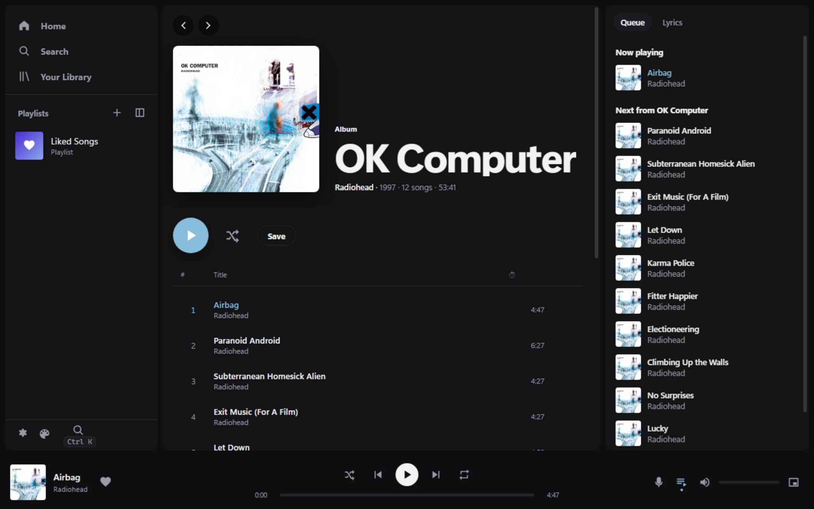
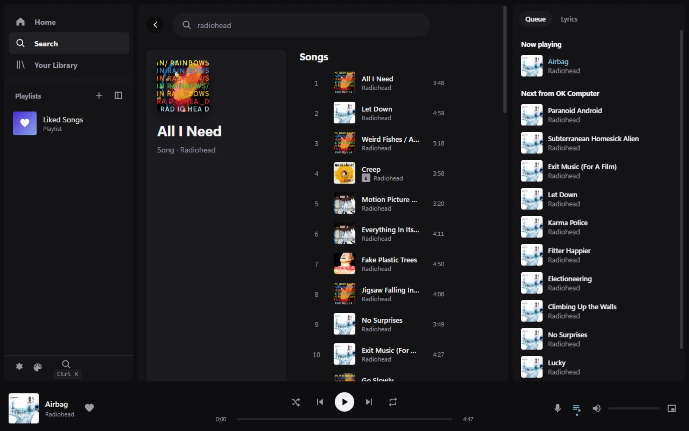
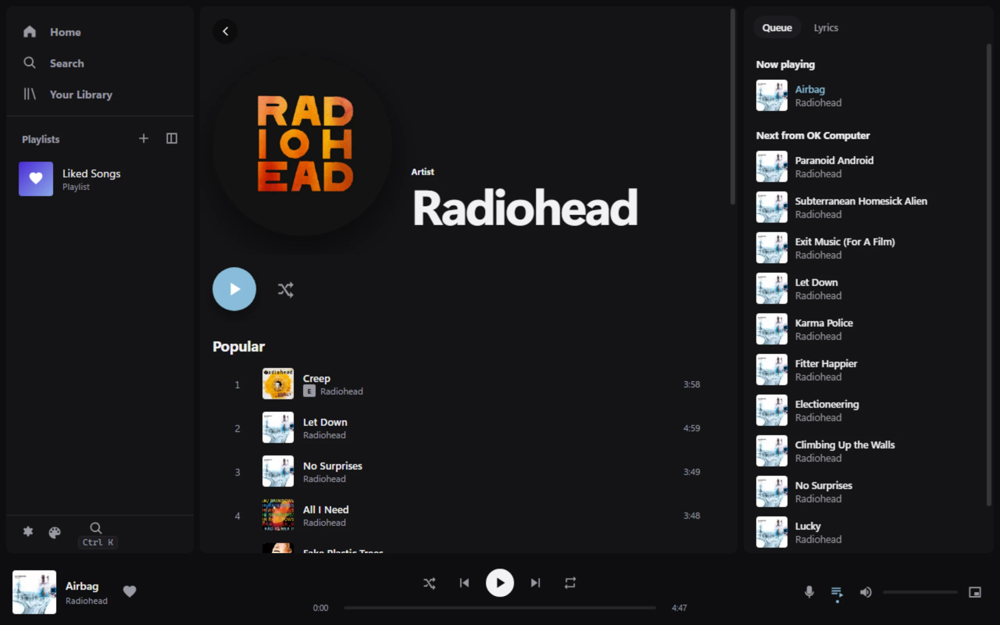
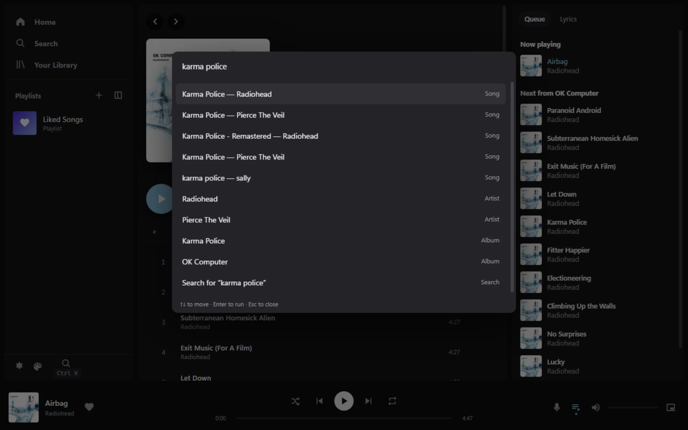
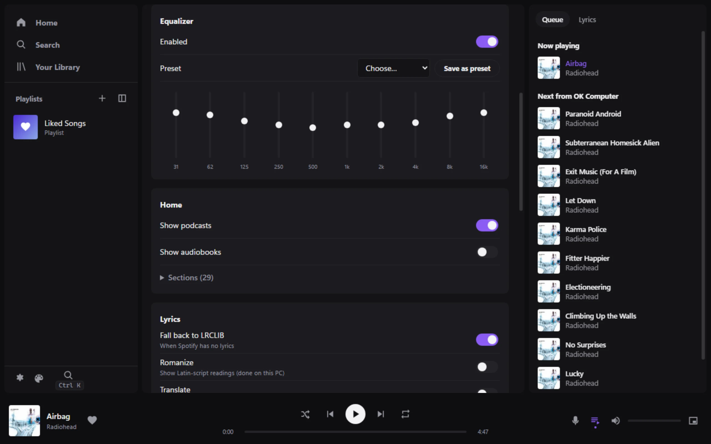
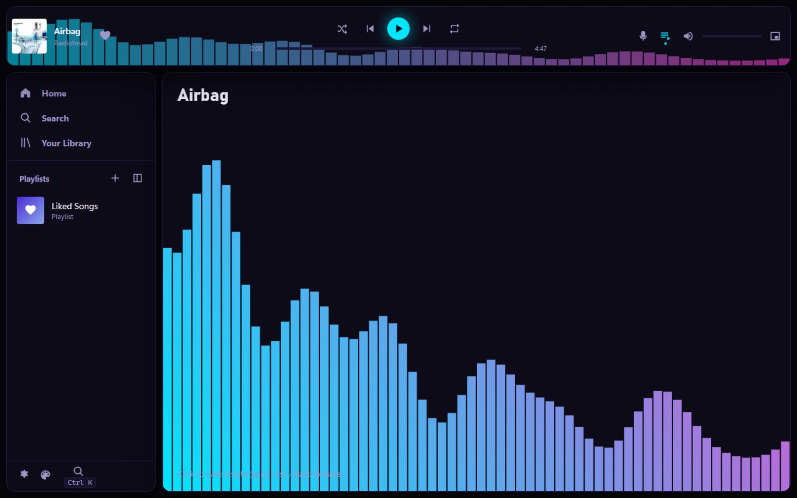
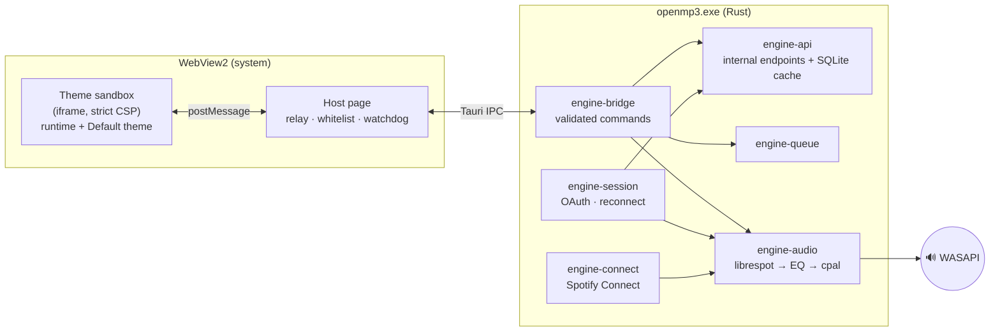

<p align="center">
  <picture>
    <source media="(prefers-color-scheme: dark)" srcset=".github/assets/banner-dark.svg">
    <source media="(prefers-color-scheme: light)" srcset=".github/assets/banner-light.svg">
    
  </picture>
</p>

<p align="center">
  <b>openmp3</b> is a fast, low-memory Spotify client for Windows that you sign into with your own Premium account.
  It starts in about half a second, plays 320&nbsp;kbps audio through its own Rust engine, and its entire UI is a sandboxed theme you can replace.
</p>

<p align="center">
  <a href="#screenshots">Screenshots</a> ·
  <a href="#build-and-run">Build &amp; run</a> ·
  <a href="#themes">Themes</a> ·
  <a href="#how-it-works">How it works</a> ·
  <a href="THEME_GUIDE.md">Theme guide</a>
</p>

<p align="center">
  
  
  
  
  
</p>

<p align="center">
  
</p>

> [!IMPORTANT]
> This is a **personal-use** project. It needs a **Spotify Premium** account; librespot quits on Free accounts. It is not affiliated with or endorsed by Spotify.

## Why

The official desktop app is a full Chromium bundle that idles at hundreds of megabytes, nags, and adds itself to startup. openmp3 keeps only what's needed for everyday listening. It uses the system WebView2 for the UI and a native Rust engine for login, streaming, the queue and audio.

**Measured on the dev PC** (release build, Default theme, `scripts/measure.ps1`, 2026-10-07):

| | Result |
|---|---|
| Cold start to usable UI (cached library) | ~0.4–0.5 s |
| Memory, window open (Task Manager, all processes) | ~115 MB (the `openmp3.exe` engine itself is ~15–19 MB) |
| Memory, closed to tray | ~27 MB |
| CPU idle / paused | ~0.2 % of one core |
| CPU while playing | ~7 % of one core (~0.4 % of the whole PC) |
| Startup entries, updater services, ads | none |

## Screenshots

<table>
  <tr>
    <td width="50%"><br><sub><b>Search</b>: songs, artists, albums, playlists and podcasts.</sub></td>
    <td width="50%"><br><sub><b>Artist and album pages</b>, plus song radio and recommendations.</sub></td>
  </tr>
  <tr>
    <td width="50%"><br><sub><b>Ctrl+K command bar</b>: run any action or jump to any song from the keyboard.</sub></td>
    <td width="50%"><br><sub><b>10-band EQ</b> with presets, crossfade, normalization and cache size.</sub></td>
  </tr>
  <tr>
    <td width="50%"><br><sub><b>Themes replace everything</b>: the bundled <i>Spectrum</i> example moves the player bar and adds a visualizer.</sub></td>
    <td width="50%" align="center"><br><sub><b>Mini player</b>: always-on-top window. Closing the main window keeps music playing in the tray.</sub></td>
  </tr>
</table>

## Features

| Listening | Library and discovery | Windows integration |
|---|---|---|
| 320 kbps streaming via librespot | Playlists: create, rename, add, remove, reorder | Media keys and the Windows media overlay (SMTC) |
| Gapless and dual-deck crossfade | Liked Songs, saved albums, followed artists | Taskbar thumbnail buttons |
| Persistent queue (survives restarts and new contexts) | Search, home feed, artist and album pages | Tray icon, close to tray, mini player |
| True shuffle bag plus "spread out artists" | Song radio, recommendations, autoplay | Configurable global hotkeys |
| 10-band EQ, volume normalization | Synced lyrics (LRCLIB fallback), local romanization | Spotify Connect: control it from your phone |
| Recently played songs start from the local cache | Podcasts (audio), customizable Home | Single instance; never adds itself to startup |

All library, search, home and lyrics data comes from Spotify's **internal** endpoints through the librespot session. No developer app, client ID or Web API key is involved. The endpoint code is isolated in [`engine-api/src/endpoints.rs`](src-tauri/crates/engine-api/src/endpoints.rs), so breakages are a one-file fix ([reference](docs/internal-endpoints.md)).

## Build and run

**Download:** grab the `x64-setup.exe` installer or the `portable.exe` from the [latest release](https://github.com/Hero62/openmp3/releases/latest). Builds are unsigned, so Windows SmartScreen may ask you to confirm (More info → Run anyway). Checksums are in `SHA256SUMS.txt`.

**Build from source requirements:** Windows 11 (WebView2 is preinstalled), [Rust](https://rustup.rs) (the repo pins the MSVC toolchain in `rust-toolchain.toml`), and the Visual Studio 2022 Build Tools with the C++ workload.

```bash
git clone https://github.com/Hero62/openmp3.git
cd openmp3/src-tauri
cargo build --release
```

Then run `src-tauri/target/release/openmp3.exe` (about 11 MB). On first launch, click **Log in to Spotify** in the sidebar. The sign-in happens in your browser through Spotify's own OAuth page; openmp3 never sees your password and caches only Spotify's reusable token in `%APPDATA%\openmp3`.

<details>
<summary><b>Development workflow</b></summary>

```bash
scripts/rebuild-run.sh                      # debug build with DevTools protocol on :9222
node scripts/cdp.mjs shot out.png           # screenshot the running UI
node scripts/cdp.mjs eval "mp3.nowPlaying" frame   # run JS inside the theme sandbox
cd src-tauri && cargo test --workspace      # unit tests
```

Debug builds read `themes/default/` and `ui/runtime/` from disk, so reloading the frame picks up UI changes without recompiling. Headless checks (debug builds only): `openmp3.exe --play-test`, `--engine-test`, `--api-probe`, `--api-test`. `scripts/measure.ps1 -Mode idle|playing|tray` reproduces the numbers above.

</details>

## Themes

The whole interface is a theme running in a sandboxed iframe. The built-in **Default** theme uses exactly the same public API as any theme you install, so anything it does, yours can do or replace.

A `.theme` file is a zip with up to four layers:

| Layer | File | What it changes |
|---|---|---|
| 1 | `theme.json` (required) | Colors, fonts, radius, density, accent from the album cover |
| 2 | `layout.json` | Where the sidebar, main view, queue panel and player bar go |
| 3 | `theme.css`, `components/*.html` | Full styling, plus template overrides for any component (`{{track.title}}`, `data-action="play"`) |
| 4 | `script.js` | Behavior and visualizers via the `mp3` API (player, library, queue, live FFT/beat data, EQ, storage) |

The Themes page imports `.theme` files, and can apply, duplicate, export or edit them. It can also live-link a folder that hot-reloads on every save, copy the full [theme guide](THEME_GUIDE.md) (handy for pasting into an AI agent), and show a performance meter. The [`examples/visualizer`](examples/visualizer) theme (`examples/Spectrum.theme`) uses all four layers.

> [!NOTE]
> Themes are sandboxed and can't reach the network, your files, Tauri APIs or your Spotify credentials. Every command is checked against a whitelist twice: by the host page, then by the Rust bridge. Windows asks for your OK before a third-party theme can edit theme files, change global hotkeys, turn on lyrics translation or change the cache size. A frozen or crashing theme is replaced with Default automatically, and <kbd>Ctrl</kbd>+<kbd>Shift</kbd>+<kbd>D</kbd> always resets to Default.

## How it works



The engine is a Cargo workspace in [`src-tauri/crates`](src-tauri/crates). Requirements live in [SPEC.md](SPEC.md), per-stage status and how each item was verified in [PLAN.md](PLAN.md), and current state, measurements and known issues in [HANDOFF.md](HANDOFF.md).

## Known limitations

- Premium accounts only (a librespot restriction).
- Search, the home feed and parts of artist pages use Spotify GraphQL query hashes that change occasionally; they're kept in one table in [`endpoints.rs`](src-tauri/crates/engine-api/src/endpoints.rs).
- Spotify's reusable login token is stored unencrypted in `%APPDATA%\openmp3\credentials` (librespot's format). Any program running under your Windows account can read it.
- Japanese kanji and Chinese characters aren't romanized (that needs a dictionary).
- No lossless, offline downloads, Jam, DJ, video podcasts or Canvas. These are out of scope for v1.

## Credits

Built on [librespot](https://github.com/librespot-org/librespot) for Spotify playback and the Connect protocol, [Tauri](https://tauri.app) for the shell, and [cpal](https://github.com/RustAudio/cpal) for audio output. Endpoint research drew on [go-librespot](https://github.com/devgianlu/go-librespot) and Spotify's web player.

Released under the [MIT License](LICENSE). Spotify is a trademark of Spotify AB.
